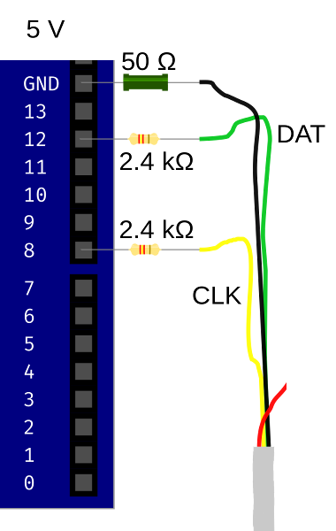
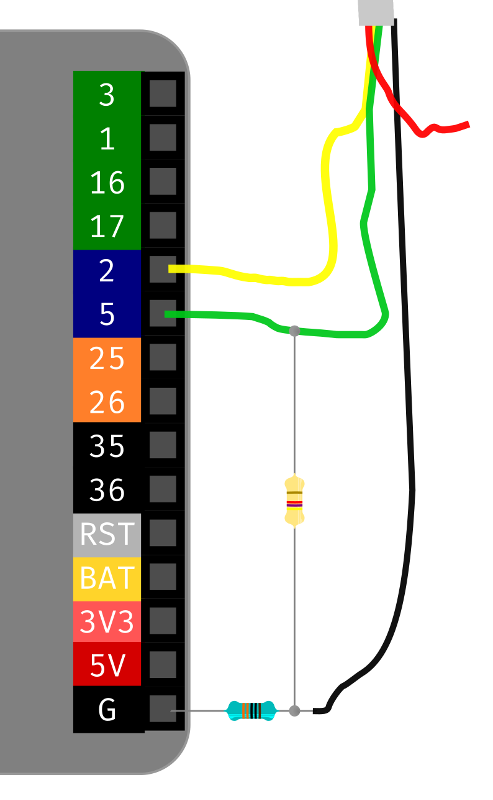

# paradox
Security research on Paradox Security Systems

Code will be published gradually as research is completed on specific sub-topics

Take a look at the slides here: https://kirils.org/slides/2018-11-28_paradox_HITB_rp.pdf

Updated presentation featuring the M5Stack attack tool: https://kirils.org/slides/2019-03-02_security_nullcon_w.pdf

